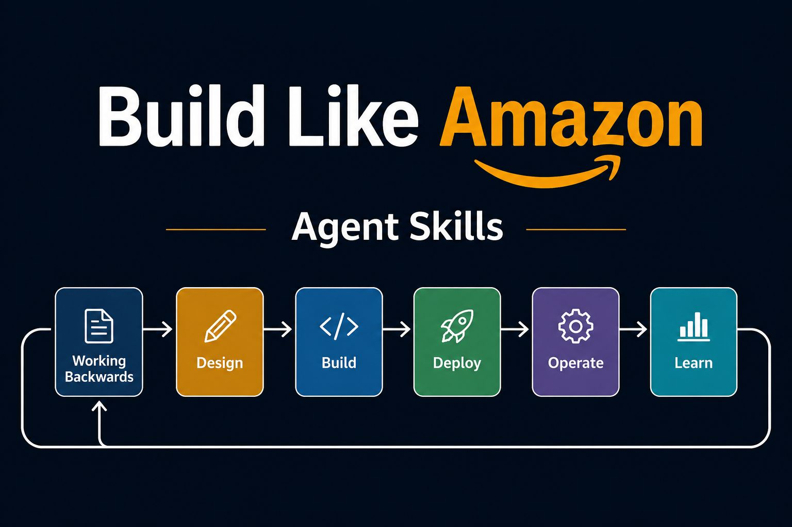
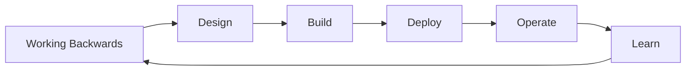

<div align="center">

# 🏗️ Build Like Amazon Agent Skills

**Production-grade engineering skills for AI coding agents, built on Amazon Way of building services.**

[](https://opensource.org/licenses/MIT)
[](#all-27-skills)
[](#10-agent-personas)

[Getting Started](docs/getting-started.md) · [Quick Start](#quick-start) · [All Skills](#all-27-skills) · [Agent Personas](#10-agent-personas) · [Philosophy](#philosophy) · [Contributing](#contributing)

</div>

---
> **Author's disclaimer:**
> *"Amazon, in my opinion, has a very unique way of designing, building, and operating large-scale distributed services. This is publicly available in a variety of formats, from YouTube videos to blog articles, knowledge frameworks like the Well-Architected Framework, and the Amazon Builders Library. My idea here was to organize this knowledge so that AI Agents can leverage this way of seeing a problem and convert it into customer-centric value, accelerating the developer's work."*
## Overview

Amazon Agent Skills encode Amazon's engineering workflows as structured markdown that AI coding agents follow consistently. Instead of relying on tribal knowledge or hoping your agent "figures it out," these skills provide deterministic, repeatable processes that mirror how Amazon builds software at scale.

<div align="center">

</div>

Each skill encodes:
- **A specific engineering workflow** (e.g., writing a PR/FAQ, conducting a design review, deploying with progressive rollout)
- **Decision frameworks** with explicit criteria for two-way vs one-way doors
- **Verification checkpoints** that prevent skipping steps
- **Rationalizations** explaining *why* each step exists (so agents don't optimize them away)

When the right workflow is unclear, agents should load [`skills/using-amazon-skills/SKILL.md`](skills/using-amazon-skills/SKILL.md) first. It is the meta-skill that routes ambiguous requests to the correct lifecycle phase and skill chain.

The skills cover the complete software lifecycle through Amazon's lens:



This circular lifecycle means every operational lesson feeds back into the next iteration — exactly how Amazon achieves compounding quality improvements over time.

## Commands

| Command | Description | Phase |
|---------|-------------|-------|
| `/onboard` | Reverse-engineer an existing project — produce design artifacts from real code so the agent understands your system | Onboarding |
| `/wb` | Full Working Backwards cycle — from customer problem to PR/FAQ | Working Backwards |
| `/listen` | Stage 1: Identify customer pain through signals and data | Working Backwards |
| `/define` | Stage 2: Write the press release and FAQ | Working Backwards |
| `/invent` | Stage 3: Explore solution space and select approach | Working Backwards |
| `/refine` | Stage 4: Iterate on the solution with stakeholder feedback | Working Backwards |
| `/test-idea` | Stage 5: Validate assumptions before committing resources | Working Backwards |
| `/design` | Conduct a design review with architecture tenets | Design |
| `/spec` | Create a new implementation spec (when design already exists) | Design |
| `/build` | Implement with Amazon's coding standards and testing bar | Build |
| `/review` | Code review with bar raiser mentality | Build |
| `/deploy` | Progressive deployment with automatic rollback | Deploy |
| `/operate` | Operational readiness and runbook generation | Operate |
| `/learn` | Correction of Errors — blameless post-incident analysis | Learn |

## Quick Start

> 👉 **New here? Read [`docs/getting-started.md`](docs/getting-started.md) first** — it walks you through install + 4 hands-on scenarios (new product, existing project onboarding, small change, production incident) in ~10 minutes. The setup snippets below are also there, with full context.

<details>
<summary><strong>Claude Code (recommended)</strong></summary>

**Option A — Plugin (recommended, zero conflict with your project)**

```bash
git clone https://github.com/robisson/build-like-amazon.git
claude --plugin-dir /path/to/build-like-amazon
```

Everything loads automatically — commands, skills, agents, and patterns. Commands are available as `/build-like-amazon:wb`, `/build-like-amazon:design`, etc. Your project's `CLAUDE.md` stays completely untouched.

**Option B — Local install (copies commands and rules into your project)**

```bash
git clone https://github.com/robisson/build-like-amazon.git

# Slash commands
cp -r build-like-amazon/.claude/commands/ your-project/.claude/commands/

# Rules (additive — does NOT touch your CLAUDE.md)
mkdir -p your-project/.claude/rules
cp build-like-amazon/CLAUDE.md your-project/.claude/rules/build-like-amazon.md

# Optional: symlink skills/, agents/, patterns/ so commands can reference them
ln -s "$(pwd)/build-like-amazon/skills" your-project/skills
ln -s "$(pwd)/build-like-amazon/agents" your-project/agents
ln -s "$(pwd)/build-like-amazon/patterns" your-project/patterns
```

Then use slash commands directly:

```
/wb Start a new Working Backwards cycle for our authentication service
/design Review the architecture for the payment processing module
/deploy Plan progressive deployment for the API v2 release
```
</details>

<details>
<summary><strong>Cursor / Windsurf</strong></summary>

Copy the rules file into your project, or reference the full `skills/` directory:

```bash
git clone https://github.com/robisson/build-like-amazon.git .build-like-amazon
cp .build-like-amazon/.cursor/rules/amazon-skills.md .cursor/rules/amazon-skills.md
```

Or add to your `.cursorrules` / Windsurf rules:

```
Follow the engineering methodology in .build-like-amazon/skills/ for all development work.
Read .build-like-amazon/AGENTS.md for operating behaviors.
Start with /wb for new features. Run /design before implementation. Never skip approval gates.
```

See [docs/cursor-setup.md](docs/getting-started.md) for detailed configuration.
</details>

<details>
<summary><strong>Gemini CLI</strong></summary>

Install as native skills for auto-discovery:

```bash
git clone https://github.com/robisson/build-like-amazon.git
gemini skills install ./build-like-amazon/skills/
```

Or reference in `GEMINI.md`:

```bash
cp -r build-like-amazon/.gemini/commands/ your-project/.gemini/commands/
```
</details>

<details>
<summary><strong>Kiro IDE & CLI</strong></summary>

Kiro uses three mechanisms: **skills** (workflow guidance), **steering** (persistent operating rules), and **commands** (slash commands). To get the full workflow running:

```bash
git clone https://github.com/robisson/build-like-amazon.git
cd your-project

# 1. Skills — router files + full skill library
cp -r build-like-amazon/.kiro/skills/ .kiro/skills/
cp -r build-like-amazon/skills/ .kiro/skills/amazon/

# 2. Steering — operating contract (approval gates, assumptions, simplicity)
mkdir -p .kiro/steering
cp build-like-amazon/AGENTS.md .kiro/steering/amazon-engineering.md

# 3. Commands — slash commands (/wb, /design, /build, /deploy, etc.)
cp -r build-like-amazon/.kiro/commands/ .kiro/prompts/
```

Then use slash commands directly:

```
/wb Start a new Working Backwards cycle for our authentication service
/design Review the architecture for the payment processing module
/build Execute the approved specs
/deploy Plan progressive deployment for the API v2 release
```

See [Kiro docs](https://kiro.dev/docs/skills/) for more on skills, steering, and commands.
</details>

<details>
<summary><strong>GitHub Copilot</strong></summary>

Use agent definitions from `agents/` as Copilot personas and skill content in `.github/copilot-instructions.md`:

```bash
git clone https://github.com/robisson/build-like-amazon.git .build-like-amazon
cat .build-like-amazon/AGENTS.md >> .github/copilot-instructions.md
```
</details>

<details>
<summary><strong>OpenAI Codex</strong></summary>

Use this repository as a portable skill library for Codex. Keep `AGENTS.md` as the operating contract, and keep the library in `.build-like-amazon/` so Codex can load skills, personas, templates, references, and command definitions on demand:

```bash
git clone https://github.com/robisson/build-like-amazon.git .build-like-amazon
cp .build-like-amazon/AGENTS.md ./AGENTS.md
```

Then ask Codex to use the library explicitly:

```
Use AGENTS.md as the operating contract.
Use .build-like-amazon/skills/ as the skill library.
Use .build-like-amazon/agents/ for bar raiser personas.
Use .build-like-amazon/.claude/commands/ as the slash-command definitions.

When I invoke /wb, /design, /spec, /build, /review, /deploy, /operate, or /learn,
load the matching command file from .build-like-amazon/.claude/commands/ and follow its process.
Do not skip approval gates or verification checkpoints.
```

Example:

```
Use /wb to work backwards from this idea: [describe the customer problem].
Read AGENTS.md first, then load .build-like-amazon/.claude/commands/wb.md.
Pause after each Working Backwards stage and wait for my explicit approval.
```

Recommended model: `gpt-5.2-codex` for long-running agentic coding tasks, with higher reasoning effort for one-way door decisions such as public APIs, data migrations, security changes, and production rollouts.
</details>

<details>
<summary><strong>OpenCode / Aider / Other Agents</strong></summary>

Skills are plain Markdown — they work with any agent that accepts system prompts or instruction files:

```bash
git clone https://github.com/robisson/build-like-amazon.git .build-like-amazon
```

Point your agent to:
- `AGENTS.md` — Core operating behaviors (approval gates, assumptions, simplicity)
- `skills/` — 27 workflow skills organized by lifecycle phase
- `agents/` — 10 bar raiser personas for specialized review

See [docs/getting-started.md](docs/getting-started.md) for the full setup guide.
</details>

## All 27 Skills

### Working Backwards (6 skills)

| Skill | File | Description |
|-------|------|-------------|
| Working Backwards Full Cycle | [`wb-full-cycle.md`](skills/working-backwards/SKILL.md) | Complete Working Backwards process from customer problem to validated solution |
| Listen | [`wb-listen.md`](skills/wb-listen/SKILL.md) | Identify and validate customer pain through quantitative and qualitative signals |
| Define | [`wb-define.md`](skills/wb-define/SKILL.md) | Write the press release and FAQ — force clarity of thought through narrative |
| Invent | [`wb-invent.md`](skills/wb-invent/SKILL.md) | Explore the solution space with divergent thinking, then converge on approach |
| Refine | [`wb-refine.md`](skills/wb-refine/SKILL.md) | Iterate on the solution with progressive stakeholder feedback loops |
| Test Idea | [`wb-test-idea.md`](skills/wb-test-and-iterate/SKILL.md) | Validate assumptions with minimal investment before committing resources |

### Design (6 skills)

| Skill | File | Description |
|-------|------|-------------|
| Design Review | [`design-review.md`](skills/design-review/SKILL.md) | Architecture review with tenets, trade-off analysis, and decision records |
| API Design | [`design-api.md`](skills/api-contract-first/SKILL.md) | Design APIs that are hard to misuse — naming, versioning, error contracts |
| Data Modeling | [`design-data.md`](skills/design-document/SKILL.md) | Schema design for durability, query patterns, and evolution |
| Security Review | [`design-security.md`](skills/threat-modeling/SKILL.md) | Threat modeling and security architecture validation |
| Dependency Management | [`design-dependencies.md`](skills/dependency-management/SKILL.md) | Design dependency failure behavior — timeouts, retries, circuit breakers, bulkheads, graceful degradation |
| Feature Flag Lifecycle | [`design-flags.md`](skills/feature-flag-lifecycle/SKILL.md) | Design controlled exposure — safe defaults, kill switches, rollout metrics, and cleanup |

### Build (6 skills)

| Skill | File | Description |
|-------|------|-------------|
| Build | [`build.md`](skills/incremental-implementation/SKILL.md) | Implementation with Amazon's coding standards — small PRs, tested, documented |
| Code Review | [`build-review.md`](skills/code-review-bar-raising/SKILL.md) | Review code with bar raiser mentality — correctness, readability, operational impact |
| Testing Strategy | [`build-testing.md`](skills/test-driven-development/SKILL.md) | Test pyramid, property-based testing, and chaos engineering patterns |
| Infrastructure as Code | [`build-iac.md`](skills/infrastructure-as-code/SKILL.md) | Define infrastructure declaratively with reviewable, testable, rollback-aware changes |
| Technical Debt | [`build-tech-debt.md`](skills/operational-code/SKILL.md) | Identify, classify, and systematically address technical debt |
| Spec-Driven Implementation | [`spec-driven-implementation/SKILL.md`](skills/spec-driven-implementation/SKILL.md) | Bridge between Design Document and code — decompose into vertical specs (requirements → design → tasks) with dependency ordering and parallel execution |

### Deploy (3 skills)

| Skill | File | Description |
|-------|------|-------------|
| Progressive Deployment | [`deploy-progressive.md`](skills/progressive-deployment/SKILL.md) | Canary → regional → global rollout with automated rollback triggers |
| Feature Flags | [`deploy-flags.md`](skills/feature-flag-lifecycle/SKILL.md) | Execute flag rollout — gradual activation, guardrails, cleanup, and emergency kill |
| Rollback Playbook | [`deploy-rollback.md`](skills/pipeline-safety/SKILL.md) | Decision framework for rollback vs. roll-forward with time-bound criteria |

### Operate (2 skills)

| Skill | File | Description |
|-------|------|-------------|
| Operational Readiness | [`operate-readiness.md`](skills/operational-readiness-review/SKILL.md) | Pre-launch checklist — alarms, dashboards, runbooks, load testing |
| Runbook Generation | [`operate-runbooks.md`](skills/operational-excellence/SKILL.md) | Generate executable runbooks from system architecture and failure modes |

### Learn (2 skills)

| Skill | File | Description |
|-------|------|-------------|
| Correction of Errors | [`learn-coe.md`](skills/correction-of-errors/SKILL.md) | Blameless post-incident analysis — timeline, root cause, action items |
| Metrics Review | [`learn-metrics.md`](skills/metrics-review/SKILL.md) | Weekly/monthly operational metrics review with trend analysis |

### Onboarding (1 skill)

| Skill | File | Description |
|-------|------|-------------|
| Brownfield Discovery | [`brownfield-discovery/SKILL.md`](skills/brownfield-discovery/SKILL.md) | Reverse-engineer an existing project — produce Design Doc, API contracts, Threat Model from real code, IaC, observability. Run once per brownfield project; output anchors all subsequent `/spec` and `/build`. |

### Meta (1 skill)

| Skill | File | Description |
|-------|------|-------------|
| Skill Authoring | [`meta-authoring.md`](docs/skill-anatomy.md) | How to write new skills — anatomy, rationalizations, verification |

## Architectural Patterns

Alongside skills, the repository carries a catalog of **architectural patterns** in [`patterns/`](patterns/). Patterns are different in nature from skills:

- **Skills** = how to *execute* a phase (workflows with gates).
- **Patterns** = what to *decide* (architectural choices that propagate across the system).

Each `patterns/<name>/PATTERN.md` declares its applicability in `applies_when:` frontmatter and includes a `Skill Impact Map` listing exactly which skills change when the pattern is adopted. During design, the agent scans the catalog and pulls in any pattern whose `applies_when:` plausibly matches the workload — it becomes a candidate alternative in the Design Doc, evaluated with concrete trade-offs.

Currently in the catalog:

| Pattern | Source | When applicable |
|---------|--------|-----------------|
| [Cell-Based Architecture](patterns/cell-based-architecture/PATTERN.md) | AWS Well-Architected guidance (by Robisson Oliveira) | Workloads requiring extreme resilience, high scalability, testability and reduced scope of impact in failures |

## 10 Agent Personas

Bar Raiser agents and specialized sub-agents provide review and verification at critical stages:

| Persona | Role | Invoked By | Focus |
|---------|------|-----------|-------|
| **Customer Obsession Bar Raiser** | Validates customer-centricity | `/wb`, `/listen`, `/define` | Is this solving a real customer problem? Is the narrative clear? |
| **Architecture Bar Raiser** | Reviews system design | `/design` | Simplicity, blast radius, operational burden, evolution path |
| **Code Quality Bar Raiser** | Enforces implementation standards | `/build`, `/review` | Readability, testability, error handling, naming |
| **Security Bar Raiser** | Validates security posture | `/design`, `/build` | Threat model coverage, least privilege, data protection |
| **Operations Bar Raiser** | Ensures operational excellence | `/deploy`, `/operate` | Observability, rollback capability, failure modes |
| **Simplicity Bar Raiser** | Guards against over-engineering | All phases | Is this the simplest solution that could work? YAGNI enforcement |
| **Learning Bar Raiser** | Ensures lessons are captured | `/learn` | Root cause depth, action item quality, knowledge sharing |
| **Requirements Analyzer** | Cross-requirement consistency check | `spec-driven-implementation` | Ambiguities, conflicts, unstated assumptions, missing edge cases |
| **Task Planner** | Dependency ordering and parallelization | `spec-driven-implementation` | Dependency graph, waves, critical path, one-way door decisions |
| **Implementation Verifier** | Property-based verification | `spec-driven-implementation` | PBT properties, regression detection, design divergence |

Each bar raiser asks pointed questions and can **block progression** to the next phase if their criteria aren't met. This mirrors Amazon's actual bar raiser program where designated reviewers ensure hiring/design/operational standards don't erode over time.

## Philosophy

### Why This Approach?

Amazon's engineering culture is **highly encodable** — [explicit mechanisms, documented processes](https://docs.aws.amazon.com/wellarchitected/latest/operational-readiness-reviews/building-mechanisms.html), and structured reviews translate directly into agent instructions. Implicit cultural norms require human judgment that AI agents don't reliably possess. That's why encoding Amazon's mechanisms as skills works so well: every step is specific, verifiable, and repeatable.

### Core Principles

**Mechanisms over good intentions.** Every skill encodes a *mechanism* — a repeatable process that produces consistent outcomes regardless of who (or what) executes it. Good intentions don't scale; mechanisms do.

**[Bar raisers at every stage.](https://aws.amazon.com/blogs/enterprise-strategy/bar-raising-as-a-principle/)** Quality doesn't come from a final review — it comes from raising the bar continuously. Each phase has dedicated bar raiser agents that ask hard questions and can block progression.

**Circular lifecycle.** The arrow from Learn back to Working Backwards is the most important arrow in the system. Every COE, every metrics review, every operational lesson feeds directly into the next iteration. This is how Amazon achieves compounding quality.

**[Two-way doors vs. one-way doors.](https://www.aboutamazon.com/news/company-news/2016-letter-to-shareholders)** Not every decision needs the same rigor. Skills explicitly classify decisions and adjust process weight accordingly:
- **One-way doors** (irreversible): Full process, multiple bar raisers, explicit sign-off
- **Two-way doors** (reversible): Lighter process, bias for action, iterate quickly

### What This Is NOT

- ❌ A rigid framework that slows you down
- ❌ A replacement for engineering judgment  
- ❌ A cargo cult of Amazon processes
- ❌ A claim that Amazon's way is the only way

### What This IS

- ✅ Encodable engineering wisdom for AI agents
- ✅ Guardrails that prevent common failure modes
- ✅ A starting point you should adapt to your context
- ✅ Battle-tested patterns from operating services at massive scale

## References

All the skills in this project are grounded in publicly available resources. Key sources include:

- **[AWS Well-Architected Framework](https://aws.amazon.com/architecture/well-architected/)** — Six pillars: Operational Excellence, Security, Reliability, Performance Efficiency, Cost Optimization, Sustainability
- **[Amazon Builders' Library](https://aws.amazon.com/builders-library/)** — 20+ articles on deployment, operations, dependency management, and distributed systems design
- **[Operational Readiness Reviews (ORR)](https://docs.aws.amazon.com/wellarchitected/latest/operational-readiness-reviews/wa-operational-readiness-reviews.html)** — How AWS distills incident learnings into launch checklists
- **[Correction of Errors (COE)](https://aws.amazon.com/blogs/mt/why-you-should-develop-a-correction-of-error-coe/)** — Blameless post-incident analysis mechanism
- **[2016 Bezos Shareholder Letter](https://www.aboutamazon.com/news/company-news/2016-letter-to-shareholders)** — Type 1 (one-way door) vs Type 2 (two-way door) decision framework
- **[Amazon Leadership Principles](https://www.aboutamazon.com/about-us/leadership-principles)** — Customer Obsession, Bias for Action, Ownership, Insist on Highest Standards
- **[Working Backwards (book)](https://www.workingbackwards.com/)** — By Colin Bryar & Bill Carr, the definitive guide to Amazon's product development process

See [`docs/references.md`](docs/references.md) for the full list of 49 references with URLs and descriptions.

## License

[MIT](LICENSE)

---

<div align="center">

[Report an Issue](https://github.com/robisson/build-like-amazon-agent-skills/issues)

</div>
