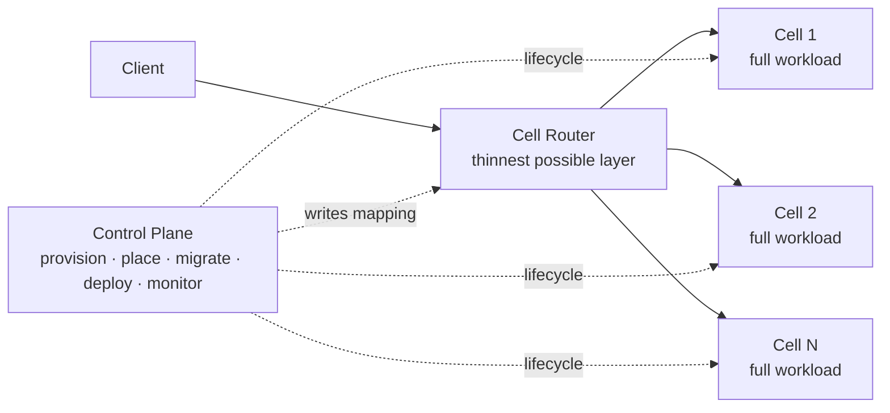

# Cell-Based Architecture

## Overview

A cell-based architecture replicates your full workload into multiple isolated instances called **cells**, each handling a subset of customers or traffic, behind a thin **cell router** that maps requests to the correct cell using a **partition key**. The pattern brings the same fault-isolation logic AWS applies at the level of Availability Zones and Regions down into your own workload.

The shipbuilding metaphor is exact: a cell is a watertight bulkhead. A breach floods one compartment; the ship stays afloat. A bad deploy, a poison-pill request, a noisy tenant, or a misbehaving client damages one cell; the rest of your service keeps serving.

If a workload uses 10 cells to serve 100 requests, a cell failure leaves 90% of the traffic unaffected. With 100 cells, 99%. The trade is operational complexity: dozens or hundreds of replicas to deploy, monitor, and evolve.

This document is the canonical Build Like Amazon reference for adopting cell-based. It is faithful to the AWS Well-Architected whitepaper *Reducing the Scope of Impact with Cell-Based Architecture* (Sep 2023) and links each architectural decision back to the workflows and skills in this repo.

---

## When to Choose This

Adopt cell-based when **all** of these hold:

- Any downtime causes outsized customer, reputational, or financial damage
- You operate at ultra-scale, or are an FSI workload critical to economic stability
- Your RPO target is < 5 seconds and RTO < 30 seconds
- You serve multi-tenant traffic and at least some tenants would pay for dedicated tenancy
- Failure modes you fear most are *cascading*: poison pills, bad deploys, traffic spikes, noisy neighbors, data corruption

The whitepaper's decision question is the right one to write on the board:

> **"Is it better for 100% of customers to experience a 5% failure rate, or 5% of customers to experience a 100% failure rate?"**

If your answer is the second, cell-based is on the table. If the first is acceptable, the operational cost of cells is hard to justify.

## When NOT to Choose This

- Single-tenant or low-tenant-count workload
- Acceptable blast radius is already the whole region (i.e., your DR strategy already accepts a full region down)
- Engineering org cannot sustain operating tens-to-hundreds of replicas (CI/CD, observability, on-call, account/quota management)
- Cost ceiling does not absorb the duplication of infrastructure

Cells are not a failover domain. They contain *cascading failures*, not dependency failures or single points of failure. If the failure you are protecting against is a single dependency outage, look first at static stability and bulkheads inside a single instance — cells alone will not save you.

## Decision Classification

Most adoption decisions for cell-based are **one-way doors** because they leak into your data model and public contract. Treat them with the rigor that demands.

| Decision | Door | Why |
|---|---|---|
| Adopt cell-based at all | One-way | Reverting requires merging cells back, not feasible after data is partitioned at scale |
| Partition key choice | One-way | Embedded in routing, data layout, and possibly the public API |
| Cell-id exposed in client contract (DNS, header, URL) | One-way | Clients build against it; cannot remove without breaking them |
| Cell topology (Multi-AZ vs Single-AZ) | One-way-ish | Drives stateful component choices; migration is expensive |
| Partition mapping algorithm | Two-way (with effort) | Migratable via override tables, but rebalancing has cost |
| Cell sizing (max TPS / GB / tenants) | Two-way | Re-sizable downward by sharding, upward only by adding cells |
| Cell router implementation | Two-way | The router is the thinnest layer; can be re-platformed if isolation is preserved |

---

## Architectural Components

A cell-based system has exactly three component types. Resist adding a fourth.

### 1. Cell

A cell is **a complete instance of your workload, with everything needed to operate independently**. Application Load Balancer + EC2 + RDS + cache + queues — whatever your stack is, the *whole stack* lives inside the cell.

Cell properties (the whitepaper's invariants):

- Independent: no cross-cell API calls
- Unaware: a cell does not know other cells exist
- Stateless toward peers: no shared databases, S3 buckets, or caches with another cell
- Encouraged: separate AWS accounts per cell

Cross-cell dependencies erode the entire benefit. If you must have one (e.g., for a transient migration), document it explicitly in the design and burn it down.

### 2. Cell Router

The router is the **thinnest possible layer**. Its only job is to inspect the request, extract the partition key, and dispatch to the correct cell.

Required properties:

- As simple as possible, but not simpler
- Request-dispatching isolation between cells (one cell unreachable does not stop routing to others)
- Minimal business logic
- Abstracts cellular implementation and complexity from clients
- Fast and reliable
- Constant-work patterns over reactive patterns (Colm MacCárthaigh, *Reliability, constant work, and a good cup of coffee*)

The router is the only component that holds shared state across all cells, which makes it a single point of failure by design. It must itself be built with maximum reliability — and ideally cellularized too. Service limits, sizing, and observability rules that apply to cells apply to the router.

### 3. Control Plane / Data Plane

The control plane handles administrative tasks: provisioning cells, de-provisioning cells, migrating customers between cells, deploying changes, updating router mappings, monitoring capacity.

The data plane is the cell + router doing the actual work — serving customer traffic.

This split matters because **control planes fail more often than data planes**. The whitepaper aligns to REL11-BP04: *Rely on the data plane and not the control plane during recovery*. Routing decisions, once loaded, must keep working even if the control plane, S3, or an AZ becomes unavailable.

CAP-theorem framing from the whitepaper:
- **Control plane → CP** (it prefers to fail rather than corrupt routing state)
- **Data plane → AP** (it prefers to keep serving, even on stale routing data)

Concrete consequence for design: if your router reads cell mappings from S3, load them into memory at boot and stream updates. Do **not** make every request synchronously read S3 — that couples your data plane to the control plane.

---

## Cell Topology

Two options. Pick one consciously.

### Multi-AZ Cells (default for most workloads)

Each cell spans multiple AZs and uses regional/Multi-AZ AWS services (Aurora, DynamoDB, ALB, etc.). A cell survives an AZ failure transparently.

**Advantages**
- Wider use of serverless and regional services
- Cell self-resiliency comes from AWS Multi-AZ services without sharing state externally
- Lower operational burden

**Disadvantages**
- Less control over AZ failures, especially **gray failures** where evacuation would be the right move

**Choose when**: your service is not exposing AZ-scoped behavior to customers (most SaaS, most APIs).

### Single-AZ Cells

Each cell lives entirely inside one AZ. Suited to services that already expose AZ as a failure unit (analogous to EC2).

**Advantages**
- Precise detection of *which AZ* is failing; targeted mitigation
- Natural fit when customers explicitly choose an AZ

**Disadvantages**
- Requires three cell routers (one per AZ in a 3-AZ region) and clients must select the correct zonal endpoint
- Requires AZ-scoped underlying services
- Demands an explicit DR mechanism (active-passive or active-active) since a Single-AZ cell does not survive its own AZ failing — and replication across AZs starts to break the cell isolation principle

### Should a Single-AZ cell fail over on AZ unavailability or gray failure?

The whitepaper's answer is nuanced: **cells were not designed as failover domains.** If an AZ goes down with Single-AZ cells, a third of cells (and their customers) go down with it.

You have two paths:

1. **Accept the scope.** Cells contain *cascading* failures. A real AZ outage is treated by tolerating the impact within the partition that was tied to that AZ.
2. **Add a DR layer on top.** Each Single-AZ cell has one or more replicas in other AZs, with a replication strategy (RDS Multi-AZ, DynamoDB global tables, ElastiCache, Kinesis) and a DR posture (pilot light, warm standby, active-active per the *DR of Workloads on AWS* whitepaper). Costlier and more complex. Required if you genuinely need cell-level survival of zone failure or gray failure.

If your workload is not exposing AZ-scoped behavior to customers, prefer Multi-AZ cells.

---

## Partition Key

The partition key decides which cell every request goes to.

**Selection rules from the whitepaper:**

1. Match the **grain** of the service — the natural way the workload subdivides with minimal cross-grain interactions
2. Be easily accessible in most API calls (direct parameter or trivial transformation)
3. Account for **maximum cell size**: a partition key whose largest value cannot fit in a single cell is a planning failure

Example trap: `customerId` looks obvious for SaaS. But what when one customer's traffic outgrows a cell? You cannot cap a customer. The fix: a **composite partition key** combining `customerId` with a second business-aligned dimension (e.g., `customerId + region`, `customerId + product`).

### Cross-cell calls

Some operations (e.g., scatter-gather queries) inherently cross the grain. They are inevitable but must remain the minority.

**Rule from the whitepaper**: cells should not call each other directly. Cross-cell calls go back through the router. This preserves isolation and observability.

---

## Partition Mapping Algorithms

How to map a partition key to a cell. The whitepaper describes four, presented without endorsement — choose by your service's properties.

### 1. Full mapping

Every key is explicitly mapped to a cell.

| Pros | Cons |
|---|---|
| Simple to implement | Critical read/write dependency on the mapping table |
| Maximum control over distribution and migration | Read-your-writes consistency required |
| | Large state; long bootstrap time if held in memory |
| | Performance cost when cardinality is very high |

Best for: low-to-moderate cardinality, workloads that need explicit tenant placement (e.g., dedicated cells for premium tenants).

### 2. Prefix and range-based mapping

Map ranges of keys (or hashes) to cells.

| Pros | Cons |
|---|---|
| Reduces full-mapping cardinality cost | Hot-cell risk: no control over which keys in a range are heavy |

Best for: keys with natural range structure and roughly uniform distribution.

### 3. Naïve modulo / fixed partition number

Hash the key, modulo by cell count.

| Pros | Cons |
|---|---|
| Trivial to implement | Adding/removing cells churns *all* mappings |
| Even distribution; avoids hot cells | |
| Minimal state (cell count) | |

Best for: cell counts that change rarely; even traffic per key.

### 4. Consistent hashing

Map keys to a large fixed pool of logical buckets, then map buckets to physical cells. Adding/removing cells only re-maps a small fraction of buckets.

| Pros | Cons |
|---|---|
| Adding cells does not rebalance everything | Possible high peak-to-average ratio (uneven spread) without extra state |
| Simple to implement | |

Variants the whitepaper points to: Ring Consistent Hash (Karger et al.), Jump Consistent Hash (Lamping & Veach), Multi-probe Consistent Hashing (Appleton & O'Reilly).

Best for: cell counts expected to grow over time; workloads tolerant of small rebalancing windows.

### Mandatory complement: override table

**Regardless of which algorithm you pick** (except Full Mapping, which already supports it), keep a **partition override table** that forces specific keys to specific cells. You will need it for:

- Testing in production safely
- Quarantining a misbehaving tenant
- Routing a heavyweight key to a dedicated cell

Provisioning a key into the cell router (and applying overrides) is a **control plane** task. The data-plane router consumes the resulting mapping; it does not compute placement.

---

## Cell Router Implementation Options

The whitepaper presents four non-exhaustive options.

### Amazon Route 53

Per-tenant DNS record points to the assigned cell's endpoint. Combines naturally with Route 53 Application Recovery Controller for AZ/Region failover and gray-failure evacuation.

- Data plane SLA: 100% on Route 53 itself
- Lowest infrastructure for the router layer
- Constant-work pattern fits DNS naturally
- Trade-off: DNS TTLs and client-side caching dictate change-propagation latency

Use when: HTTP/HTTPS traffic, partition key resolves to a small enough domain to justify per-tenant DNS, you can tolerate DNS-propagation latency for re-routing.

### Amazon API Gateway (with DynamoDB / DAX)

API Gateway as the regional, serverless router; DynamoDB (optionally with DAX) as the cell-mapping store.

- Native throttling, rate limiting, usage plans, canary deployments
- DynamoDB SLA 99.99% (99.999% with global tables)
- DAX caching from milliseconds to microseconds

Use when: HTTP APIs, many small mappings, want managed throttling.

### Compute layer (EC2/ECS/EKS/Lambda) + S3

Control plane writes cell mappings to S3. The compute layer loads them into memory at boot; a listener thread updates memory on S3 change events.

- Maximum flexibility and customization
- Static stability: requests keep being routed even if S3, the control plane, or an AZ becomes unavailable
- Overload-control patterns from *Avoiding overload in distributed systems by putting the smaller service in control* apply to control-plane → router synchronization

Use when: routing logic does not fit DNS or API Gateway models; you need full control over routing semantics; your team can operate the compute fleet.

### Non-HTTP routing (events, messages)

The router does not have to be synchronous HTTP. With queues (SQS) or streams (MSK/Kinesis), the router consumes from the entry queue, inspects the message, and forwards to the correct cell's queue. The cell-mapping memory and S3 listener pattern carry over.

Use when: workload entry point is asynchronous (payments processing, ingestion pipelines, event-driven systems).

### Resilience of the router

The router is your only shared component. Treat it like the highest-criticality service you own:

- Cellularize it too (router cells)
- Apply the same service-limit, sizing, and observability rules
- Keep the routing logic constant-work — no business logic creep
- Static stability: the router must keep dispatching to known cells even if the control plane, S3, or DynamoDB is degraded

> The routing layer must scale infinitely, but the *set of problems* you solve there is a strict subset of what a non-cellularized monolith would face.

---

## Cell Sizing

Three forces pull at cell size. Pick a point.

| Force | Pull |
|---|---|
| Big enough to fit the largest legitimate workload | Larger |
| Small enough to test at full scale and stay below AWS account/service limits | Smaller |
| Big enough to gain economies of scale | Larger |

### Trade-offs (the table from the whitepaper)

| Smaller cells | Larger cells |
|---|---|
| More cells to deploy and operate | Fewer cells to deploy and operate |
| Cell outage / drain impacts a small percentage of fleet | Cell outage / drain impacts a large percentage of fleet |
| Less likely to hit scaling limits | More likely to hit scaling limits |
| Reduced scope of impact | Reduced number of customer splits across cells |
| Easier and cheaper to test at full scale | Easier to operate fewer of them |
| More idle resources | Better capacity utilization, more economy of scale |

There is no universal right answer. The optimum point is service- and customer-specific, but **needn't be extremely large for any service**.

### Define your scaling dimensions (REL01-BP01)

Cell sizing is the practice of capping a known limit. Your business defines the unit:

- Transactions per second per cell?
- Customers or tenants per cell?
- GB of stored data, GB/s of throughput per cell?

You must be able to answer all three. If you cannot, you have not finished sizing.

**Multiple scaling dimensions** matter when one customer threatens to outgrow a cell. Defining a second dimension lets you carve out dedicated cells for outliers, which doubles as a paid product offering for enterprise customers who want hard isolation.

### Know and respect the limit

Knowing your cell limit is necessary but insufficient. You must enforce it.

Mechanisms:

- **Load testing** + **chaos engineering** to discover the actual limit
- **Load shedding** when the cell approaches its limit (token bucket, e.g., the EC2 API)
- **Service-side rate limits** at the API layer (API Gateway resource-/method-/stage-level)
- **Pre-emptive migration** when a tenant's growth is on a trajectory to breach the limit

Cell limits are not aspirational — they are alarm thresholds.

### Cost as a sizing input

The whitepaper closes the section with a reminder: **calculate the cost of each cell**. Cell sizing is a margin and economy-of-scale decision, not just a reliability one.

---

## Cell Placement

Cell placement is a control-plane responsibility. It covers two things: **onboarding** (assigning a new tenant to a cell) and **provisioning** (creating new cells when needed).

Required observability for placement:

- Capacity per cell (max)
- Used capacity per cell (current)
- Per-tenant utilization within a cell
- AWS service quotas per cell's account

Headroom rule (REL01-BP06): never operate at the threshold. Keep enough gap below max for failover, traffic spikes, and rebalancing.

For data- and state-heavy workloads, placement becomes its own deep capability. Inputs to placement decisions:

- Cell dimensions (fixed or variable over time)
- Partition-key dimensions (changing over time)
- Cost of moving a key between cells
- Co-tenancy benefits or affinity

If a single tenant or partition key starts dominating a cell, placement triggers a migration.

---

## Cell Migration

Migration is the discipline of moving customers or data from one cell to another without breaking isolation. Common triggers:

- A customer outgrows their cell
- Cell rebalancing (cell added or removed)
- Quarantining a misbehaving tenant
- Promoting a tenant to a dedicated cell

### Stateful migration phases (whitepaper recipe)

1. **Clone** the data into the new location as a non-authoritative copy
2. **Flip** the new location to authoritative
3. **Redirect** writes/reads from old to new
4. **Forget** the old location

During the transition, mapping decisions get tricky: cross-cell redirects, multiple iterations of the mapping algorithm against different versions of mapping state, or both.

### Alternative: control-plane-driven migration

The router and the cells coordinate via the control plane. The control plane completes the state transition before the new cell is marked ready to receive traffic. Cells avoid talking to each other; isolation is preserved.

### Required upfront

Build the migration mechanism **on day one**. Cells that are easy to create but impossible to migrate become permanent prisons for tenants. The whitepaper is explicit: even if a tenant outgrows a cell quickly, you must already own the tooling to move them.

---

## Cell Deployment

This is where most teams underestimate the operational cost.

If today you deploy code to one environment per region, with cells you deploy to **N cells** per environment per region. For tens, hundreds, or thousands of cells. Manual deployment is impossible.

### Required from day one

- Fully automated CI/CD pipeline
- Phased deployment **cell-by-cell** or **wave-by-wave** (e.g., one cell, then 10%, then 50%, then full)
- The first cell deployed in a wave can be a **canary cell** with synthetic traffic
- Per-cell rollback when a wave shows error signals
- Pipeline that mirrors AWS service-team patterns: pre-prod → one-box → AZ → region → multi-region, but at cell granularity

Anchor best practices the whitepaper points to:

- REL08-BP05 — Deploy changes with automation
- OPS05-BP10 — Fully automate integration and deployment
- OPS06-BP01 — Plan for unsuccessful changes
- OPS06-BP07 — Fully automate integration and deployment
- OPS06-BP08 — Automate testing and rollback

> "My CI/CD pipeline is my release captain." If your pipeline cannot release safely cell-by-cell without a human in the loop, you are not ready to operate cells.

---

## Cell Observability

If you had one stack before, now you have many. Observability has to become **cell-aware** end-to-end.

Requirements:

- Every metric, log, and trace tagged with `cell_id`
- Per-cell dashboards (every cell, individually) and aggregate dashboards
- Per-cell alarms with per-cell thresholds
- Distributed tracing that follows the request through router → cell → cell internals
- Ability to identify, for any given request, which cell served it

The whitepaper points to *Amazon Builders' Library*: *Instrumenting distributed systems for operational visibility* and *Building dashboards for operational visibility*.

A reasonable mental model: every cell is its own service from an observability standpoint. Aggregated views are derived from per-cell views, never the other way around.

---

## Best Practices (the whitepaper's four)

1. **Your current stack is your cell zero.** Start by treating today's deployment as cell 0, add the router on top, and migrate traffic into cells gradually.
2. **Start with multiple cells from day one.** Two cells from the start surfaces the operational problems a one-cell system hides.
3. **Start with a cell-migration mechanism from day one.** Migration is hard, often coordination-heavy, and you will need it earlier than you expect.
4. **Perform a failure mode analysis of your cell.** A cell is a failure-isolation boundary, so you must know what happens when each component fails partially or fully — and prove other cells are unaffected. A worksheet of *component → cause → probability → mitigation* is enough to start.

---

## Skill Impact Map

Adopting cell-based changes how nearly every other skill in this repo is applied. This map is the contract: when a design references this pattern, all of the linked skills must be re-read and re-applied through the cell-based lens.

| Skill | How adoption changes it |
|---|---|
| [`design-document`](../../skills/design-document/SKILL.md) | Add: cell topology choice, partition key, mapping algorithm, router design, control-plane responsibilities, sizing dimensions, placement strategy, migration mechanism. Diagrams must show router + cells separately. |
| [`api-contract-first`](../../skills/api-contract-first/SKILL.md) | Decide whether `cell_id` is part of the public contract (DNS/header/URL) or fully transparent. Document the answer — it is a one-way door. |
| [`dependency-management`](../../skills/dependency-management/SKILL.md) | Cells are natural bulkheads; cross-cell dependencies are forbidden by default. Re-evaluate every external dependency for *per-cell* failure modes. |
| [`threat-modeling`](../../skills/threat-modeling/SKILL.md) | Add: router as single point of compromise, cell-id forgery, override-table tampering, cross-cell data leakage via misrouted requests. |
| [`infrastructure-as-code`](../../skills/infrastructure-as-code/SKILL.md) | All IaC parametrized by `cell_id`. Separate AWS accounts per cell encouraged. Per-cell quotas and limits are first-class. |
| [`spec-driven-implementation`](../../skills/spec-driven-implementation/SKILL.md) | Specs split into: cell-router, cell control plane, per-cell workload, observability, deployment pipeline, migration tooling. Order matters — control plane and router land before the second cell. |
| [`feature-flag-lifecycle`](../../skills/feature-flag-lifecycle/SKILL.md) | Flags evaluated **per cell**, not globally. Rollout rolls cell-by-cell. Kill switches operate at cell granularity. |
| [`pipeline-safety`](../../skills/pipeline-safety/SKILL.md) | Pipeline gates per cell wave. Canary cell mandatory. Per-cell smoke tests block the next wave. |
| [`progressive-deployment`](../../skills/progressive-deployment/SKILL.md) | Deploy strategy is **cell-by-cell**, not region-by-region. First cell may be a synthetic-traffic canary. Auto-rollback triggered on per-cell signals. |
| [`operational-excellence`](../../skills/operational-excellence/SKILL.md) | Per-cell dashboards + aggregate dashboards. Per-cell alarms. Runbooks parametrized by `cell_id`. On-call must know how to drain or quarantine a cell. |
| [`operational-readiness-review`](../../skills/operational-readiness-review/SKILL.md) | ORR adds: cell-zero plan, multi-cell from day one, migration mechanism existence, failure-mode analysis worksheet, per-cell observability, account/quota strategy. |
| [`correction-of-errors`](../../skills/correction-of-errors/SKILL.md) | Impact measured in `cells affected / total cells` and `customers affected / total customers`. COE asks: *did the cell boundary contain the failure as designed?* |
| [`metrics-review`](../../skills/metrics-review/SKILL.md) | Per-cell utilization metrics added (TPS, GB, tenant count). Drift toward cell limit triggers placement / migration / scale-out. |
| [`mechanism-creation`](../../skills/mechanism-creation/SKILL.md) | Mechanisms required: cell-zero plan, multi-cell-from-day-one, migration tooling, failure-mode analysis cadence, per-cell load test in CI. |

---

## Failure Mode Analysis Worksheet

Run this before launching the second cell, and re-run quarterly. Output is a table:

| Component | Failure cause | Probability | Per-cell mitigation | Cross-cell isolation proof |
|---|---|---|---|---|
| Application Load Balancer | AZ failure | M | Multi-AZ ALB | Each cell has its own ALB; failure does not propagate |
| Primary database | Primary instance failure | M | Multi-AZ failover | Per-cell DB; no cross-cell replication |
| Cache | Memory pressure | M | LRU eviction, connection cap | Per-cell cache, no shared cluster |
| Cell router | Routing-state corruption | L | Constant-work memory map, S3-versioned overrides | Router cells; one failure does not impact dispatch to others |
| Control plane | API outage | L | Static stability — router serves last-known map | Data plane keeps serving; no new cells provisioned, no migration |
| Bad deploy | Code bug | M | Canary cell + auto-rollback per wave | Bad cell rolled back before next wave |
| Poison pill | Malformed customer payload | M | Per-cell circuit breakers, request quotas | Bad input contained to the customer's cell |

The worksheet is a mechanism, not a document. Every new component added to the cell template requires a row.

---

## Cell-Based vs Shuffle-Sharding (FAQ)

The whitepaper closes with this FAQ because the question always comes up.

**Shuffle-sharding** generates random shards of resources (like dealing hands from a deck of cards) so that two unlucky tenants are unlikely to land on the *same* shard. Cells contain *all* of a tenant's traffic; shuffle-sharding spreads a tenant across multiple unlucky-overlapping shards.

They are not the same. They compose:

- **Cell-based**: a cell is self-contained, no shared state across cells
- **Shuffle-sharding**: applied **inside** a cell to spread per-tenant load across that cell's resources

Cross-cell shuffle-sharding violates the cell isolation principle and is not used.

Further reading the whitepaper points to:
- *Workload isolation using shuffle-sharding* (AWS Builders' Library)
- *Shuffle Sharding: Massive and Magical Fault Isolation* (Colm MacCárthaigh)

---

## Verification Checklist

Before declaring "we have a cell-based architecture", every item must be true:

- [ ] At least 2 cells in production
- [ ] Cell topology decision (Multi-AZ vs Single-AZ) is documented in the design doc
- [ ] Partition key is documented and validated against max-tenant size
- [ ] Partition mapping algorithm chosen, with override table support
- [ ] Cell router is the thinnest possible layer; no business logic inside
- [ ] Cell router is itself cellularized or operated to the same reliability bar
- [ ] Control plane / data plane split is explicit; data plane keeps serving when control plane is degraded
- [ ] Each cell can be deployed and rolled back independently
- [ ] CI/CD pipeline deploys cell-by-cell or wave-by-wave with canary cells
- [ ] Cell sizing dimensions defined (TPS, customers, GB, etc.) with hard limits
- [ ] Load testing and chaos engineering have validated the cell limits
- [ ] Load shedding (token bucket or equivalent) enforces the cell limit
- [ ] Cell migration mechanism exists and has been exercised at least once
- [ ] Every metric, log, and trace is tagged with `cell_id`
- [ ] Per-cell dashboards and per-cell alarms exist
- [ ] Failure-mode analysis worksheet exists and is current
- [ ] On-call runbook covers cell drain, cell quarantine, cell rollback
- [ ] Account / service-quota strategy documented per cell
- [ ] Cost-per-cell modeled and accepted

---

## Tenets

1. **A cell is a complete copy of the workload.** No shared state with other cells. No cross-cell calls. If you must, route through the cell router.
2. **The router is the thinnest possible layer.** Business logic in the router is technical debt that will hurt you in an outage.
3. **The data plane survives the control plane.** Static stability is non-negotiable for cell-based.
4. **Cells contain cascading failures, not dependency failures.** If the failure you fear is a single dependency outage, fix that first.
5. **Operate cells from day one as if you have a hundred.** The skills that scale to 100 cells must exist when you have 2.
6. **Limits are alarms, not aspirations.** A cell at its limit is a cell that is failing — load-shed before then.
7. **Every cell is observed individually.** Aggregate views are derived; per-cell views are primary.
8. **Migration is a feature, not an afterthought.** Build it before you need it.

---

## Required Reading

Primary source (read in full before adopting):

- AWS Well-Architected — *[Reducing the Scope of Impact with Cell-Based Architecture](https://docs.aws.amazon.com/wellarchitected/latest/reducing-scope-of-impact-with-cell-based-architecture/reducing-scope-of-impact-with-cell-based-architecture.html)* (Sep 2023)

Cross-references the whitepaper relies on:

- AWS Well-Architected Reliability Pillar — *[Use bulkhead architectures to limit scope of impact](https://docs.aws.amazon.com/wellarchitected/latest/reliability-pillar/rel_fault_isolation_use_bulkhead.html)*
- AWS Whitepaper — *[Fault Isolation Boundaries](https://docs.aws.amazon.com/whitepapers/latest/aws-fault-isolation-boundaries/abstract-and-introduction.html)*
- AWS Whitepaper — *Disaster Recovery of Workloads on AWS*
- REL11-BP04 — *Rely on the data plane and not the control plane during recovery* (static stability)
- REL01-BP01, REL01-BP06 — Service quotas, constraints, and headroom
- Amazon Builders' Library — *Reliability, constant work, and a good cup of coffee* (Colm MacCárthaigh)
- Amazon Builders' Library — *Avoiding overload in distributed systems by putting the smaller service in control*
- Amazon Builders' Library — *Workload isolation using shuffle-sharding*
- Amazon Builders' Library — *Instrumenting distributed systems for operational visibility*
- Amazon Builders' Library — *Building dashboards for operational visibility*

AWS services commonly used in cell-based architectures (the whitepaper's examples):

- Routing: Route 53 (with Application Recovery Controller), API Gateway
- Cell mapping store: DynamoDB (+ DAX), S3
- Compute layer: EC2, ECS, EKS, Lambda
- Async entry points: SQS, MSK, Kinesis
- CI/CD: CodeCommit, CodeBuild, CodePipeline
