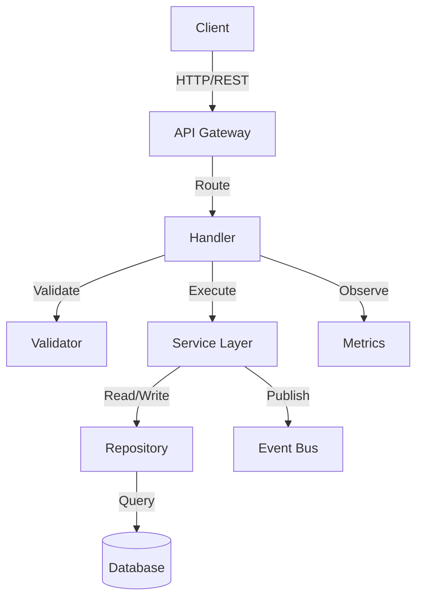
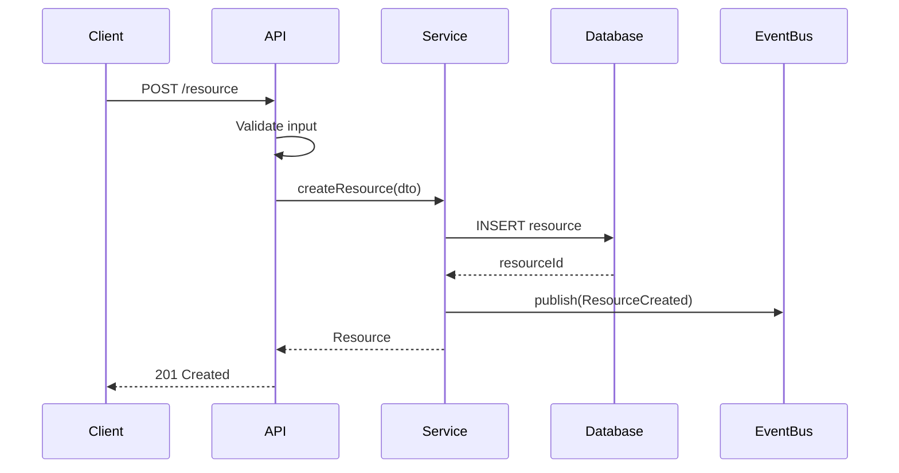
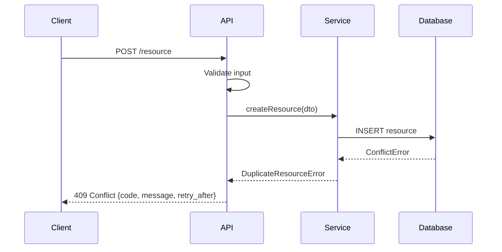

# Design: [Slice Name]

> **Spec for**: [Parent Design Document title and link]
> **Slice**: [N of M] — [One-line description]
> **Author**: [Name]
> **Status**: Draft | In Review | Approved
> **Last Updated**: [Date]
> **Requirements**: [Link to this slice's requirements.md]

---

## 1. Overview

[2-3 paragraphs explaining what this slice implements, the approach chosen, and why. This is NOT a copy of the macro design — it adds implementation-level specificity. Explain what decisions were deferred in the Design Document that are now resolved here.]

**Key Design Decisions for This Slice:**
- [Decision 1]: [Choice made] because [rationale]. Alternative considered: [rejected option] because [why rejected].
- [Decision 2]: [Choice made] because [rationale].

---

## 2. Architecture

### 2.1 Component Diagram



### 2.2 Sequence Diagram (Happy Path)



### 2.3 Sequence Diagram (Error Path)



---

## 3. Components & Interfaces

### 3.1 [Component Name — e.g., ResourceController]

```typescript
interface ResourceController {
  /**
   * Creates a new resource.
   * @param request - Validated creation request
   * @returns Created resource with generated ID
   * @throws ValidationError - Input fails schema validation (400)
   * @throws ConflictError - Resource already exists (409)
   * @throws ServiceUnavailableError - Downstream dependency unavailable (503)
   */
  create(request: CreateResourceRequest): Promise<Resource>;

  /**
   * Retrieves a resource by ID.
   * @param id - Resource identifier (UUID v4)
   * @returns Resource if found
   * @throws NotFoundError - Resource does not exist (404)
   */
  get(id: ResourceId): Promise<Resource>;
}
```

**Responsibilities:**
- Input validation and sanitization
- Request routing to service layer
- HTTP status code mapping from domain errors
- Request/response logging

**Error Contract:**
| Domain Error | HTTP Status | Response Body |
|-------------|-------------|---------------|
| ValidationError | 400 | `{code: "INVALID_INPUT", fields: [...]}` |
| NotFoundError | 404 | `{code: "NOT_FOUND", resource_type, id}` |
| ConflictError | 409 | `{code: "CONFLICT", existing_id}` |
| ServiceUnavailableError | 503 | `{code: "UPSTREAM_UNAVAILABLE", retry_after_ms}` |

---

### 3.2 [Component Name — e.g., ResourceService]

```typescript
interface ResourceService {
  createResource(dto: CreateResourceDto): Promise<Resource>;
  getResource(id: ResourceId): Promise<Resource>;
  listResources(filter: ResourceFilter, pagination: Pagination): Promise<Page<Resource>>;
}
```

**Responsibilities:**
- Business logic and domain rules
- Orchestration of repository and event publishing
- Idempotency enforcement
- Retry logic for transient failures

**Invariants:**
- A resource ID is globally unique and immutable once assigned
- Creating the same resource twice (same idempotency key) returns the existing resource, not an error
- Events are published only after successful persistence (no ghost events)

---

### 3.3 [Component Name — e.g., ResourceRepository]

```typescript
interface ResourceRepository {
  save(resource: Resource): Promise<void>;
  findById(id: ResourceId): Promise<Resource | null>;
  findByFilter(filter: ResourceFilter, pagination: Pagination): Promise<Page<Resource>>;
  exists(id: ResourceId): Promise<boolean>;
}
```

**Responsibilities:**
- Data access abstraction
- Query construction and optimization
- Connection management and pooling
- Mapping between domain models and storage models

---

## 4. Data Models

### 4.1 Domain Model

```typescript
type ResourceId = string; // UUID v4

interface Resource {
  id: ResourceId;
  name: string;             // 1-255 characters, trimmed
  status: ResourceStatus;   // ACTIVE | INACTIVE | DELETED
  metadata: Record<string, string>; // max 20 keys, max 256 chars per value
  createdAt: ISO8601DateTime;
  updatedAt: ISO8601DateTime;
  version: number;          // optimistic concurrency control
}

enum ResourceStatus {
  ACTIVE = "ACTIVE",
  INACTIVE = "INACTIVE",
  DELETED = "DELETED",      // soft delete
}
```

### 4.2 Storage Schema

```sql
CREATE TABLE resources (
    id          UUID PRIMARY KEY DEFAULT gen_random_uuid(),
    name        VARCHAR(255) NOT NULL,
    status      VARCHAR(20) NOT NULL DEFAULT 'ACTIVE',
    metadata    JSONB NOT NULL DEFAULT '{}',
    created_at  TIMESTAMPTZ NOT NULL DEFAULT NOW(),
    updated_at  TIMESTAMPTZ NOT NULL DEFAULT NOW(),
    version     INTEGER NOT NULL DEFAULT 1,

    CONSTRAINT chk_status CHECK (status IN ('ACTIVE', 'INACTIVE', 'DELETED')),
    CONSTRAINT chk_name_not_empty CHECK (LENGTH(TRIM(name)) > 0)
);

CREATE INDEX idx_resources_status ON resources(status) WHERE status != 'DELETED';
CREATE INDEX idx_resources_created_at ON resources(created_at DESC);
```

### 4.3 API Request/Response Shapes

```typescript
// Request
interface CreateResourceRequest {
  name: string;                      // required, 1-255 chars
  metadata?: Record<string, string>; // optional, max 20 keys
  idempotencyKey: string;            // required, UUID v4
}

// Response
interface CreateResourceResponse {
  id: string;
  name: string;
  status: string;
  metadata: Record<string, string>;
  createdAt: string;  // ISO 8601
  updatedAt: string;  // ISO 8601
}
```

---

## 5. Error Handling

### 5.1 Error Taxonomy

| Category | Example | Detection | Response | Recovery |
|----------|---------|-----------|----------|----------|
| Client Error | Invalid input | Schema validation | 400 + field errors | Client fixes input |
| Conflict | Duplicate resource | Unique constraint | 409 + existing ID | Client uses existing |
| Transient | DB connection timeout | Connection error | 503 + retry_after | Automatic retry (3x, exp backoff) |
| Upstream | Dependency unavailable | Circuit breaker open | 503 + retry_after | Circuit breaker half-open after 30s |
| Internal | Unexpected exception | Catch-all handler | 500 + correlation ID | Alert + manual investigation |

### 5.2 Retry Policy

```yaml
retry:
  max_attempts: 3
  base_delay_ms: 100
  max_delay_ms: 5000
  backoff: exponential
  jitter: full
  retryable_errors:
    - ConnectionTimeout
    - ServiceUnavailable
    - ThrottlingException
  non_retryable_errors:
    - ValidationError
    - ConflictError
    - NotFoundError
```

### 5.3 Circuit Breaker

```yaml
circuit_breaker:
  failure_threshold: 5        # failures before opening
  success_threshold: 3        # successes to close
  timeout_ms: 30000           # time in open state before half-open
  monitored_exceptions:
    - ConnectionTimeout
    - ServiceUnavailable
```

---

## 6. Properties (Property-Based Testing)

| # | Property Name | Formal Statement | Generator Strategy | Requirement Ref |
|---|---------------|-----------------|-------------------|-----------------|
| 1 | Idempotency | `create(r, key) == create(r, key)` for all valid r and same idempotency key | Random valid CreateResourceRequest + fixed key | Req 3.1.1 AC-2 |
| 2 | Roundtrip | `get(create(r).id) == r` for all valid r (modulo server-assigned fields) | Random valid resources | Req 3.1.2 AC-1 |
| 3 | Uniqueness | `create(r1).id != create(r2).id` for all r1, r2 (different keys) | Pairs of random resources | Req 3.1.1 AC-1 |
| 4 | Monotonic timestamps | `create(r).createdAt <= create(r).updatedAt` for all r | Random resources with clock assertions | Req 3.1.1 AC-3 |
| 5 | Soft delete invariant | `delete(r); get(r.id)` returns NotFound; `list()` excludes r | Random existing resources | Req 3.2.1 AC-1 |
| 6 | Pagination completeness | `union(all_pages) == all_resources` for any page size > 0 | Random resource sets + random page sizes | Req 3.2.2 AC-1 |

---

## 7. Testing Strategy

| Level | What Is Tested | Approach | Coverage Target | Tools |
|-------|---------------|----------|-----------------|-------|
| Unit | Pure business logic, validators, mappers | PBT + example-based | 90%+ line coverage | Jest/Vitest + fast-check |
| Integration | Repository ↔ Database, Service ↔ Repository | Testcontainers | All query paths | Testcontainers + real DB |
| Contract | API request/response shapes | Schema validation tests | All endpoints | OpenAPI + Prism |
| E2E | Full user flows matching acceptance criteria | Acceptance test suite | All P0 requirements | Playwright / Supertest |
| Property | Invariants from §6 | PBT with shrinking | All listed properties | fast-check / Hypothesis |
| Chaos | Failure modes from §5 | Fault injection | All error categories | Toxiproxy / Chaos Toolkit |

---

## 8. Security

### 8.1 Authentication
[How requests are authenticated for this slice — JWT validation, API keys, mTLS, etc.]

### 8.2 Authorization
[What permissions are required — RBAC roles, resource-level policies, etc.]

### 8.3 Data Protection
- Data at rest: [Encryption approach — AES-256, KMS key rotation]
- Data in transit: [TLS 1.3 minimum]
- PII handling: [What PII exists, how it's masked/redacted in logs]

### 8.4 Input Validation
- All string inputs sanitized against [injection type]
- Maximum payload size: [N KB]
- Rate limiting: [N requests/second per client]

---

## 9. Open Questions

| # | Question | Options Considered | Recommendation | Decision | Decided By |
|---|----------|--------------------|----------------|----------|-----------|
| 1 | [Unresolved design question] | A: [option], B: [option] | [Your recommendation + why] | [Pending/A/B] | [Name] |
| 2 | [Another question] | A: [option], B: [option] | [Recommendation] | [Pending/A/B] | [Name] |

---

## 10. Revision History

| Date | Author | Change |
|------|--------|--------|
| [Date] | [Name] | Initial design |
| [Date] | [Name] | Resolved open questions from design review |
| [Date] | [Name] | Approved by [reviewer] |
